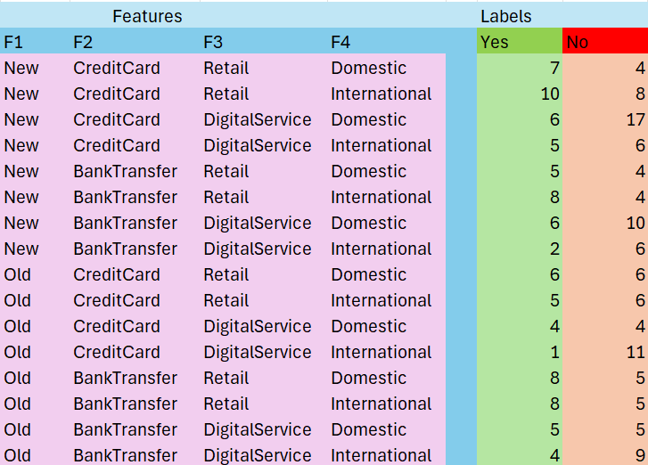

## OOPMachineLearningProject

### List of classes
- GUI.java
- FileProcessing.java
- Control.java

### What each class does!
### GUI Class   
The GUI class builds a graphical user interface (GUI) that interacts with transaction data for a  
basic fraud prediction system. It allows users to:  
- Display a frequency table of transaction data.
- Add a new transaction entry.
- Predict whether a transaction is fraudulent based on selected features.

The GUI has 3 buttons which do the following
- **SHOW TABLE** Reads and displays a frequency table generated from TransactionData.csv.
- **ADD ROW** Opens a new window where users can input new transaction data, save it, and update the frequency table/re train the data.
- **PREDICT** Based on selected attributes (like account age, payment method, etc.), predicts whether a transaction is likely fraudulent or not by analyzing the frequency table.

Important Methods:
- Constructor GUI(String title):
   - Initializes the main window, sets up the layout, creates the components, and registers action listeners.

- actionPerformed(ActionEvent e):
  - Handles button clicks
 
 

### FileProcessing Class   
The FileProcessing class reads, manipulates, and analyzes CSV files related to transaction data.  
It loads data, separates it into feature columns, appends new rows, prints data, and creates a frequency table  
based on the occurrences of combinations of features and their fraud labels.

**Attributes**  
  - *_fileName:_* The name (path) of the CSV file.  
  - *_fileExample:_* A File object representing the CSV file.  
  - *_myScanner:_* A Scanner object used for reading the file.  
  - *_values:_* Stores each line from the CSV file as a string.  
  - *_Feature & label Columns (stored separately):_*  
    - UserAccountAge
    - PaymentMethod
    - MerchantType
    - TransactionRegion
    - TransactionIsFraudulent (label)

**Key Methods**  
  - *_Constructor:_* FileProcessing(String fileName): Initializes the file name and creates a File object.  
  - *_readFile():_* Reads all lines of the file into the values list.  
  - *_printToTerminal():_* Prints every line of the file to the terminal.  
  - *_appendRow(String newRow):_* Adds a new row (as a line of text) to the end of the file.  
  - *_splitColumn():_* Splits each line of the CSV into separate ArrayLists, one for each column (skips the header).  
  - *_frequencyTable(String outputFileName, List... features):_* Generates a new CSV file where each unique combination of features is listed once, along with counts of "yes" and "no" fraud labels. Avoids processing the same row twice by using a HashSet.  
  - *_Getters:_* Provide access to each feature ArrayList individually.

### Frequency Table Image

### Link to video
https://youtu.be/DrBQhHED1hY

### If I had more time
- I would have went on to complete level 4 of the brief.
- I wouldve made a nicer GUI.
- I couldve made more error handling/better code.
